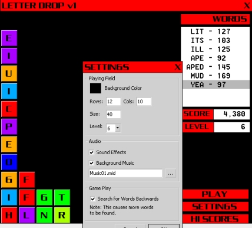



## Letter Drop v1 \- a word puzzle game

### Description

Letter Drop is a game where letters drop (duh ;) and you must (or else...) arrange them to create words. The words can be formed horizontally, vertically, or diagonally. You can also muck around with some settings. (Cool font included.)

** The game is 100% working, but not 100% polished, please, please tell me what I need to fix, I love feedback. **
 
### More Info
 

             |
---                |---
**Submitted On**   |2005-07-08 06:12:22
**By**             |[redbird77](https://github.com/Planet-Source-Code/PSCIndex/blob/master/ByAuthor/redbird77.md)
**Level**          |Intermediate
**User Rating**    |5.0 (15 globes from 3 users)
**Compatibility**  |VB 6\.0
**Category**       |[Games](https://github.com/Planet-Source-Code/PSCIndex/blob/master/ByCategory/games__1-38.md)
**World**          |[Visual Basic](https://github.com/Planet-Source-Code/PSCIndex/blob/master/ByWorld/visual-basic.md)
**Archive File**   |[Letter\_Dro191067782005\.zip](https://github.com/Planet-Source-Code/redbird77-letter-drop-v1-a-word-puzzle-game__1-61589/archive/master.zip)

